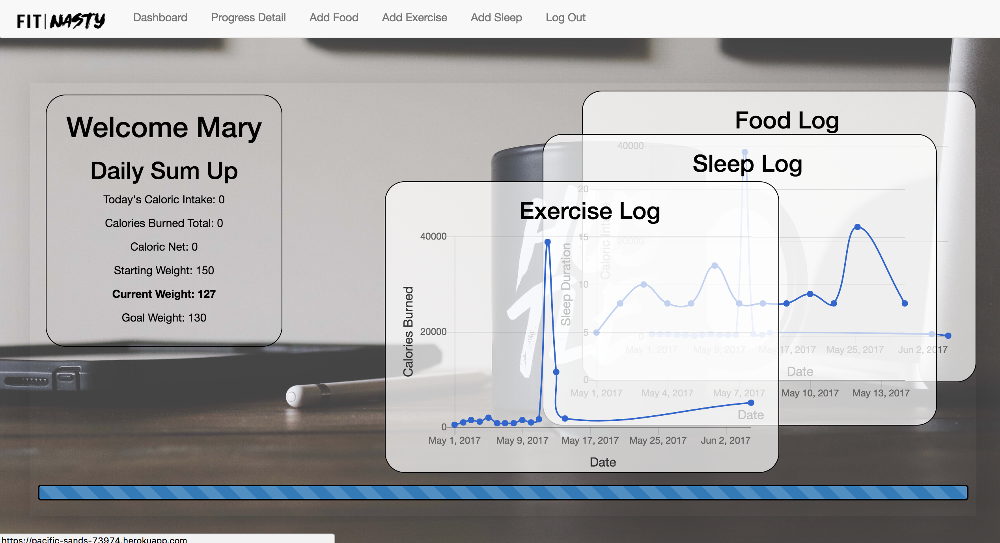
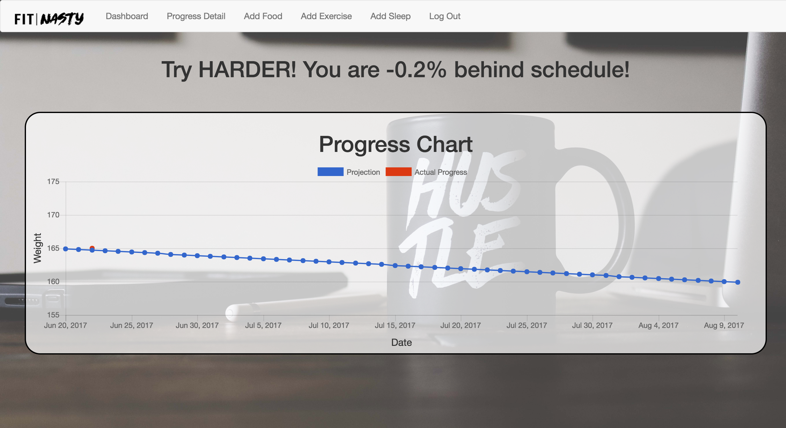
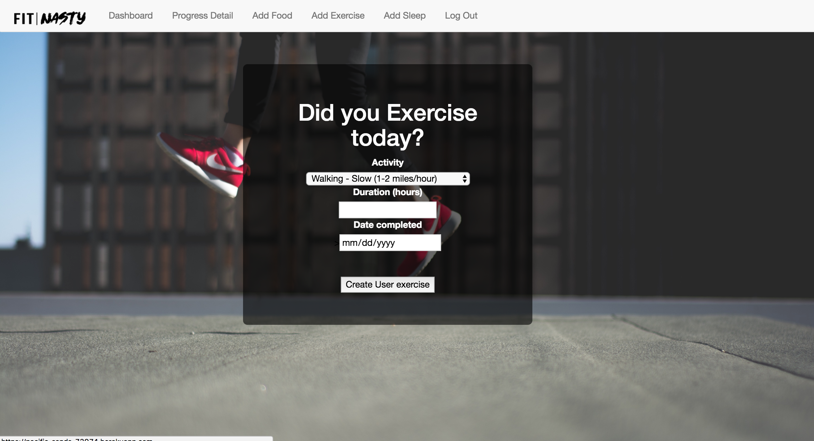

# Introduction

A simple web app that allows a user to sign-up, log-in and track their sleep, meal, and exercise. 
Calculations are done on the back end as well as an API call to get caloric data. 
Graphs are generated with ChartKick to help better visualize what is happening in the program. 
Still in the early stages, there is a lot of information that is left to still cover. 

# Images of program in action 

(Beware of loadtimes)
